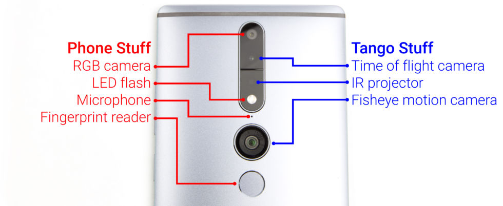

# tango

## Hardware

### Lenovo Phab 2 Pro



### Asus Zenfone AR


## Installation Hello World

- Unity3D -> new project

- Build settings -> Android -> Switch platform

- Player settings -> Other settings -> Identification -> Package Name change to something

- import package -> custom package -> TangoSDK_Ikariotikos_Unity5.unitypackage

- replace google_unity_wrapper.aar (otherwise there will be crash on startup)

- add Tango Manager

- replace default camera with Tango camera

- Enable Tango Manager - Video Overlay with Method = Texture and Raw Bytes

## Demo motion tracking

- Add some object (like a sphere)

- Tango Camera -> Enable Tango AR Screen (Script)

- Tango Camera -> Camera -> Clear flags -> Solid Color

## Demo Area learning

Prerequisites: There should be an ADF available of same room you're now in. Otherwise no localisation is possble and the image will
not disappear. Code loads the last available ADF file.

https://web.archive.org/web/20170326085044/https://developers.google.com/tango/apis/unity/unity-howto-area-learning

- Tango Manager -> Auto-connect to service -> disable

- Tango Manager -> Tango Application (Script) -> Pose Mode -> Local Area Description (Load existing)

- Add GameObject with script:

```
using System.Collections;
using UnityEngine;
using Tango;

public class AreaLearningStartup : MonoBehaviour, ITangoLifecycle
{
    private TangoApplication m_tangoApplication;

    public void Start()
    {
        m_tangoApplication = FindObjectOfType<TangoApplication>();
        if (m_tangoApplication != null)
        {
            m_tangoApplication.Register(this);
            m_tangoApplication.RequestPermissions();
        }
    }

    public void OnTangoPermissions(bool permissionsGranted)
    {
        if (permissionsGranted)
        {
            AreaDescription[] list = AreaDescription.GetList();
            AreaDescription mostRecent = null;
            AreaDescription.Metadata mostRecentMetadata = null;
            if (list.Length > 0)
            {
                // Find and load the most recent Area Description
                mostRecent = list[0];
                mostRecentMetadata = mostRecent.GetMetadata();
                foreach (AreaDescription areaDescription in list)
                {
                    AreaDescription.Metadata metadata = areaDescription.GetMetadata();
                    if (metadata.m_dateTime > mostRecentMetadata.m_dateTime)
                    {
                        mostRecent = areaDescription;
                        mostRecentMetadata = metadata;
                    }
                }

                m_tangoApplication.Startup(mostRecent);
            }
            else
            {
                // No Area Descriptions available.
                Debug.Log("No area descriptions available.");
            }
        }
    }

    public void OnTangoServiceConnected()
    {
    }

    public void OnTangoServiceDisconnected()
    {
    }
}
```

- Add UI 

UI -> canvas

Set image to: Assets -> Tango SDK -> examples -> common -> textures -> relocalize_screen

Click 'set native size'

- Select Tango Manager -> Add script RelocalizingOverlay (Assets > TangoSDK > Examples > AreaLearning > Scripts )

- Set property RelocalizingOverlay -> set property Relocalization Overlay to Canvas -> Image


